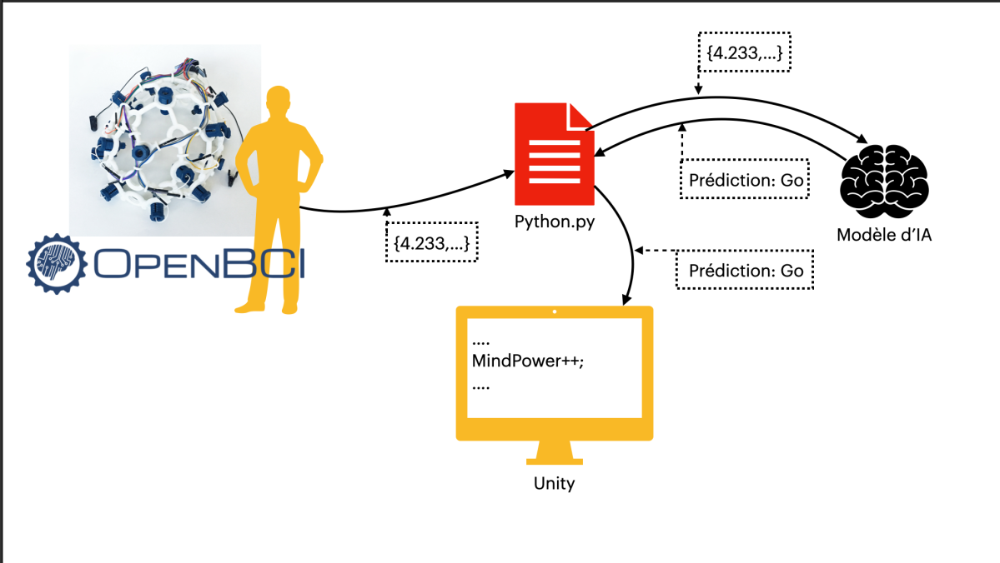
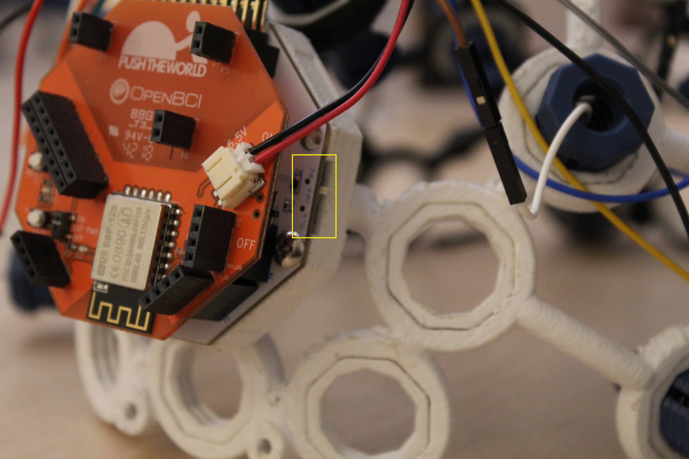
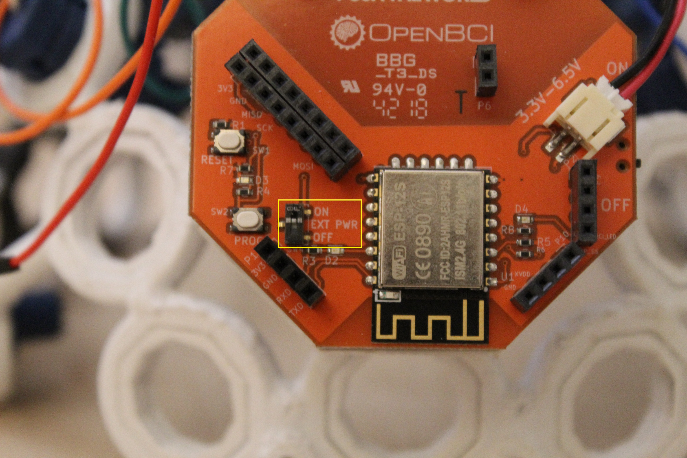
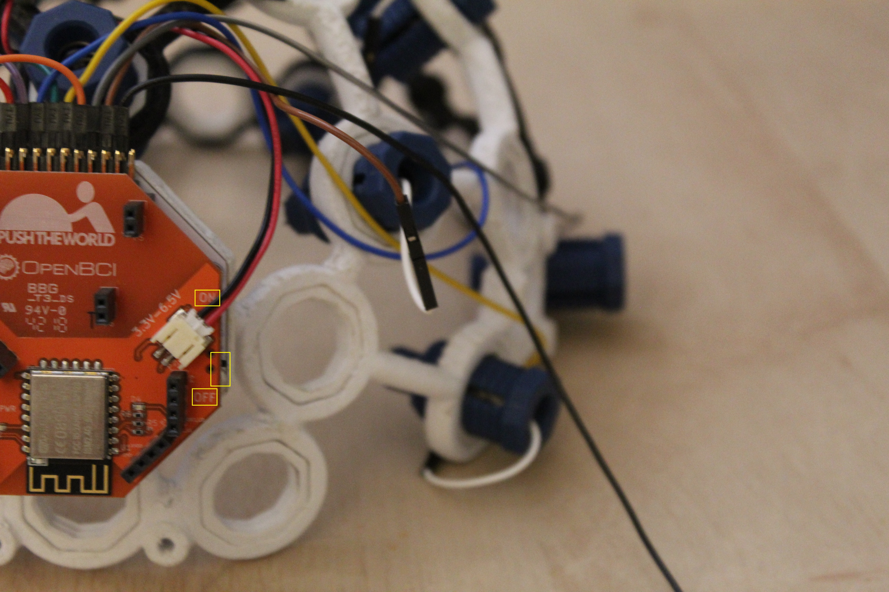
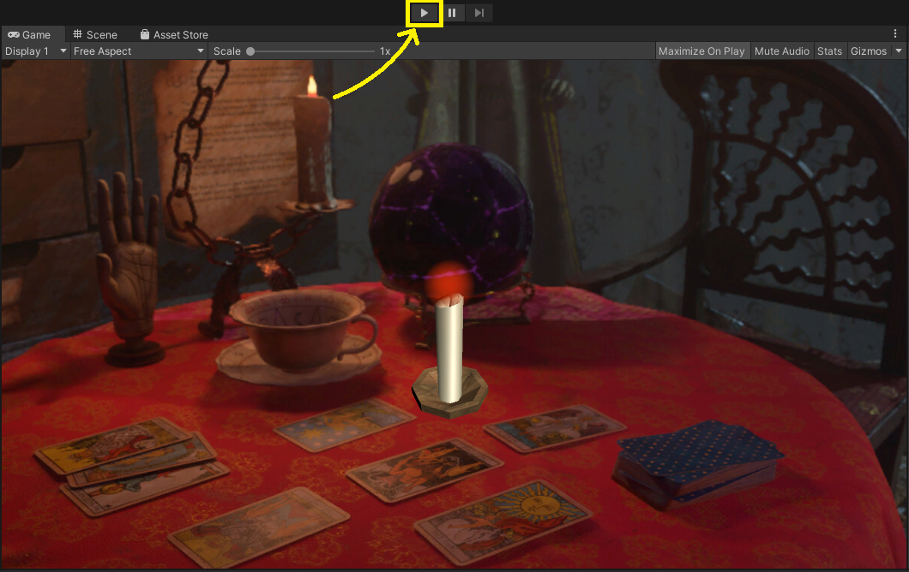

# Mind

For the English version check: [README_ENGLISH.md](README_ENGLISH.md)

## Présentation

Le projet Mind est un projet réalisé dans le cadre du centre d'innovation étudiant PoC. Il a pour but de détecter et d'analyser les signaux mentaux ou "Brainwaves" grâce à l'aide d'un casque EEG (Électroencéphalographe).

Vidéo de présentation du projet mind https://youtu.be/vZjL93esWt0 :

[](https://youtu.be/vZjL93esWt0)

La version actuelle du projet utilise le casque EEG opensource d'[OpenBCI](https://openbci.com/) : le [Ultracortex mark IV](https://shop.openbci.com/collections/frontpage/products/ultracortex-mark-iv). Le "Chipset" que l'on utilise est le [Cyton](https://docs.openbci.com/docs/02Cyton/CytonLanding) avec le [WifiShield](https://docs.openbci.com/docs/05ThirdParty/03-WiFiShield/WiFiLanding). Des membres de PoC ont imprimé et installé le casque dans une itération précédente.

## Fonctionnement

Le casque détecte les signaux et les diffuse sur son propre réseau wifi. L'ordinateur peut, en étant connecté à ce réseau, capter les données grâce à la GUI d'OpenBCI et les transmettre vers un flux LSL. Ces données peuvent ensuite être récupérées dans un script Python grâce à la librairie `pylsl`.

La donnée transmise par la GUI d'OpenBCI n'est pas un flux de données pur, mais un flux modifié. OpenBCI  propose un module de représentation en [graphe FFT](https://docs.openbci.com/docs/06Software/01-OpenBCISoftware/GUIWidgets#fft-plot) des brainwaves. Ces données FFT sont celles que l'on transmet à notre IA.

À partir de ces données, nous avons créé un dataset composé de deux labels: `go` et `none`.

Dans un premier temps, l'IA aura besoin de s'entraîner à différencier un signal `go` d'un signal `none`. Pour ce faire, nous devons concevoir une architecture prenant cette forme :

- Dataset :
  - data (données utilisées pour l'entraînement)
    - go
    - none
  - val (données utilisées pour la phase de validation)
    - go
    - none


L'IA va récupérer tous les enregistrements labellisés grâce aux fichiers, les sortir de leur contexte et les mélanger aléatoirement. Elle va ensuite procéder au processus d'apprentissage pour générer un modèle basé sur les données que vous lui avez fournies.


Notre réseau de neurones est basé sur des layers de convolution. Grâce à l'utilisation d'un tel réseau, nous pouvons analyser indépendamment chaque input de data envoyé par le casque et ainsi renvoyer un résultat en temps réel sans aucune latence.

À noter qu'il est aussi possible d'analyser les données envoyées par le casque en les regroupant par paquet. Cette méthode nécessite d'utiliser un réseau de neurones dit récurent (RNN). Une partie de nos recherches s'est orientée sur cette approche. Mais le casque ne disposant pas de suffisamment d'électrodes, nous ne pouvions en tirer un résultat suffisamment précis.

L'itération actuelle du projet utilise ces données en tandem avec une scène Unity. Un script se charge d'envoyer la prédiction de notre IA via le protocole TCP à notre application Unity.



## Installation et utilisation

Une documentation complète des produits d'OpenBCI est [ici](https://docs.openbci.com/docs/Welcome.html).

Le projet à été testé et fonctionne sur Windows. Unity est instable sous les distributions Linux, mais le projet devrait aussi fonctionner dans cet environnement.

#### Installation :
- Du casque :
  - Suivre le [tutoriel](https://docs.openbci.com/docs/04AddOns/01-Headwear/MarkIV) d'OpenBCI
- De la GUI :
  - suivre le [tutoriel](https://docs.openbci.com/docs/06Software/01-OpenBCISoftware/GUIDocs) d'OpenBCI
- De Unity :
  - Le téléchargement de [unity](https://store.unity.com/#plans-individual)
  - Comment utiliser unity : [documentation](https://docs.unity3d.com/Manual/index.html) et [vidéos](https://www.youtube.com/results?search_query=learn+unity+playlist)

#### Utilisation :
- Le casque (vue de dos):
  - Le bouton situé sur la droite du Cyton chipset doit être positionné sur `PC`

  - Le bouton situé en bas à gauche du WifiShield doit être positionné sur `ON`

  - Allumez ou éteignez le casque grâce aux valeurs `ON` et `OFF` du bouton situé à droite du WifiShield

  - Une fois allumé, le casque émet un réseau wifi auquel vous pourrez vous connecter avec votre ordinateur.
  - Positionnez le casque sur votre tête, chipset à l'arrière, et accrochez les deux pinces sur vos lobes d'oreille
- La GUI :
  - Lancez la GUI
  - Dans le `System Control Panel` sélectionnez `CYTON (live)` puis `Wifi (from Wifi Shield)` et enfin `STATIC IP`
  - Lancez la session en appuyant sur `START SESSION`
  - Commencez à recevoir des données en sélectionnant le bouton vert : `START DATA STREAM`
- Le flux de données LSL :
  - Une fois votre flux principal de données lancé, changez votre widget `Accelerometer` en un widget `Networking` en ouvrant le menu déroulant qu'est nom du widget
  - Sélectionnez le menu déroulant `Serial` et choisissez `LSL`
  - Sous la rubrique `Stream 1`, cliquez sur le menu déroulant `None` et sélectionnez `FFT`
  - cliquez sur `Start` pour lancer le flux de données LSL

La GUI d'OpenBCI fonctionne avec un système de "widgets", des modules que l'ont peut choisir et remplacer. Parmi les widgets, on retrouve les modules FFT et Networking que nous avons utilisé et dont nous allons préciser l'utilisation.

#### Unity :
- Lancez le Unity Hub
- Ajoutez ce projet à vos projets Unity : cliquez sur `ADD` et naviguez vers le dossier [unity](unity/)
- Lancez le projet avec une version compatible de Unity. Ce projet à été réalisé avec la version `2019.4.12f1`

Ca y est, votre donnée est récupérable facilement avec un script python et est déjà partiellement traitée (Donnée FFT). Les étapes suivantes ne sont applicables uniquement pour les scripts et fichiers de ce Dépot Github.

Les scripts et leur utilisation :
- [create_dataset.py](data/create_dataset.py) : créé un des datapoint numpy de 1 seconde de la forme [25,8,60]
  - 25 : quantité moyenne de datapoints par seconde
  - 8 : nombre d'électrodes de notre casque
  - 60 : La donnée FFT est disponible sur 125 fréquences mais seules celles inférieures à 60 sont utilisable à cause du bruit électromagnétique 
- [mindTrain.py](mindTrain.py) : créé un modèle de deep learning à partir des fichier numpy
- [mindPred.py](mindPred.py) : lance des prédictions sur un set de données
- [real_time.py](real_time.py) : permet de la prédiction en temps réel
  - Une fois toutes les étapes de [l'installation](#Installation) et de [l'utilisation](#Utilisation) terminées, vous pouvez utiliser ce script pour prédire `go` ou `none` en temps réel
  - ```$> python3 real_time.py chemin_du_modèle.pt```
- [mindIM.py](mindIM.py) : prédiction en temps réel + utilisation avec unity
  - Une fois toutes les étapes de [l'installation](#Installation), de [l'utilisation](#Utilisation) et de [Unity](#Unity) terminées, vous pouvez utiliser ce script pour visualiser vos prédictions sur unity en temps réel
  - ```$> python3 mindIM.py```
  - Lancez la scène Unity


## Annexe
Nous fournissons aussi une intégration d'un outil permettant de réaliser du MLOPS dans ce projet, avec Mlflow.

Mlflow est un outil permettant de suivre avec précision l'évolution de l'apprentissage de votre IA en rajouter des tags sur vos paramètres pour les faire apparaître sur la GUI que l'outil propose.

Pour la démarrer la GUI, lancez la commande `$> mlflow ui` dans votre terminal. Mlflow se lance sur le port 5000 par défaut et est accessible via cette adresse dans votre navigateur : [`http://127.0.0.1:5000/`](http://127.0.0.1:5000/)

- [Installation](https://www.mlflow.org/docs/latest/quickstart.html) de Mlflow
- [Documentation](https://www.mlflow.org/docs/latest/index.html) de Mlflow

## Conclusion


<div style="width:56%; margin-left:22%" align="justify">
L'objectif de cette itération du projet était de revenir au niveau de l'itération précédente, sur laquelle nous n'avions peu à aucune information. De construire sur cette base pour pouvoir faire une utilisation concrète du casque Mind. Malheureusement, notre projet n'est que fonctionnel et les résultats obtenus avec le casque ne sont pas concluants.
<br/>
<br/>
Notre IA actuelle ne fonctionne qu'avec deux labels et nous suposons que le casque manque de précision. Ce manque de précision avait déjà été noté lors de l'itération précédente et il ne semble pas être corrigeable. De plus, les visuels de la GUI d'OpenBCI ne ressemblent pas à toute les démonstration de ce produit disponible en ligne, ce qui laisse du doute par rapport à la fiabilité du matériel, même par rapport aux autres casques Ultracortex Mark IV.
<br/>
<br/>
Pour conclure, pour la prochaine itération, nous recommandons un casque avec plus de précision et qui soit une valeur sûre sur le plan professionnel.
</div>
