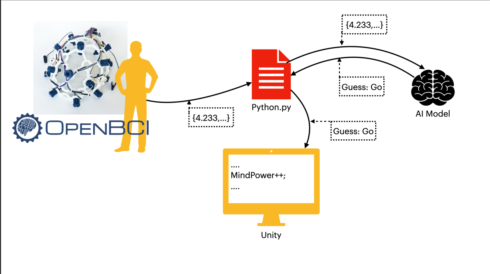

# Mind

Pour la version Francaise consultez : [README.md](README.md)

## Presentation
Mind is a project created by members of the french student association PoC. Its goal is to detect and analyze brainwaves using an EEG headset (Electroencephalograph).

Subtitled video presentation https://youtu.be/vZjL93esWt0 :

[](https://youtu.be/vZjL93esWt0)

The current version of the project uses the opensource EEG headset created by [OpenBCI](https://openbci.com/): The [Ultracortex mark IV](https://shop.openbci.com/collections/frontpage/products/ultracortex-mark-iv). The chipset we use is the [Cyton board](https://docs.openbci.com/docs/02Cyton/CytonLanding) with the [WifiShield](https://docs.openbci.com/docs/05ThirdParty/03-WiFiShield/WiFiLanding). Members of PoC printed and set up the headset in a previous iteration of the project.

## How it works

The headset detects brainwaves and transmits them using its own wifi network. While connected, a computer can receive the data through OpenBCI's GUI and relay them through an LSL data stream. The data can then be used in a python script using the `pylsl` Python library.

The data transmitted through the OpenBCI GUI is not a pure data stream but a modified one. We sent the [FFT plot](https://docs.openbci.com/docs/06Software/01-OpenBCISoftware/GUIWidgets#fft-plot) transformed data to our AI.

Using this data, we have created a dataset consisting of the `go` and `none` labels.

The AI needed to train to differentiate a `go` from a `none` signal. To that end, we needed a file architecture  as follows :

- Dataset :
  - data (data used for the training phase)
    - go
    - none
  - val (data used for the testing phase)
    - go
    - none


The AI training script gathers all of the labeled data, regardless of context, and mixes them randomly. The learning process then starts to generate a model based on the provided data.

Our neural network is based on convolution layers. This allows us to analyze each data input separately and return a result in real-time.

It is noteworthy that it is possible to analyze the data points received by bundling them. This method requires the use of a recurrent neural network (RNN). A part of our research was centered around this approach. However, the headset does not have enough electrodes, therefore this method lacks precision.

The current iteration of the project uses this AI and sends its prediction to a Unity scene using the TCP protocol.



## Setup and Usage

[here](https://docs.openbci.com/docs/Welcome.html) is a complete documentation of the OpenBCI products.

This project has been tested and works in a Windows environment. Despite Unity being unstable on Linux, the project should also work in that environment.

#### Installation :
- Of the headset :
  - follow OpenBCI's [guide](https://docs.openbci.com/docs/04AddOns/01-Headwear/MarkIV)
- Of the GUI :
  - follow OpenBCI's [guide](https://docs.openbci.com/docs/06Software/01-OpenBCISoftware/GUIDocs)
- Of Unity :
  - Download [unity](https://store.unity.com/#plans-individual)
  - How to use Unity : [documentation](https://docs.unity3d.com/Manual/index.html) and [videos](https://www.youtube.com/results?search_query=learn+unity+playlist)

#### Usage :
- Of the headset (back view):
  - The button situated on the right side of the Cyton chipset must be set to `PC`

  - The button situated on the bottom left of the Wifi SHield must be set to `ON`

  - Turn the headset `ON` or `OFF`  using the switch on the right side of the Wifi Shield

  - Once powered on, blue LEDs will turn on and the headset will emit a Wifi network to which you can connect your computer.
  - Place the headset on your head, chipset facing backward, and attach the two ear clips to your earlobes
- Of the GUI :
  - Start the GUI
  - In the `System Control Panel` select `CYTON (live)` then `Wifi (from Wifi Shield)` and finally `STATIC IP`
  - Start the session by pressing `START SESSION`
  - Start to receive data by selecting: `START DATA STREAM`
- Of the LSL data stream :
  - Once your main data stream has started, change your `Accelerometer` widget to a `Networking` widget by opening the dropdown menu situated on the widget's name
  - Open the `Serial` dropdown menu and choose `LSL`
  - Under the `Stream 1` title, open the `None` dropdown menu and select `FFT`
  - Click on `Start` to start the LSL data stream

#### Unity :
- Start the Unity Hub
- Add this project to your interface: click on `ADD` and navigate to the [unity](unity/) folder
- Launch the scene using a compatible version of Unity. This project was completed using version `2019.4.12f1`

That's it! Your data can be collected easily through a python script. The following steps only apply to scripts and files within this Github repository.

The scripts and their usage:
- [create_dataset.py](data/create_dataset.py): creates a NumPy data point containing 1 second of data with the shape [25,8,60]
  - 25: Average quantity of data points per second
  - 8: Number of electrodes of our headset
  - 60: The FFT data is represented through 125 frequencies but only the first 60 are usable because of electromagnetic noise
- [mindTrain.py](mindTrain.py): creates a deep learning model from a multitude of NumPy files
- [mindPred.py](mindPred.py): launches predictions on a data point
- [real_time.py](real_time.py): allows for real-time predictions
  - Once all of the [installation](#Installation) steps completed, you can use this script to predict `go` or `none` from data points in real-time
  - ```$> python3 real_time.py chemin_du_modèle.pt```
- [mindIM.py](mindIM.py): real-time prediction + to be used with the Unity scene
  - Once all of the [installation](#Installation),[usage](#Usage), and [Unity](#Unity) steps completed, you can use this script to visualize your predictions in real-time through Unity
  - ```$> python3 mindIM.py```
  - Start the Unity scene


## Annex
We also provide an integration of a tool allowing us to use MLOPS in this project: Mlflow.

Mlflow is a tool allowing you to follow the evolution of the learning rate of your AI with precision by adding tags to your parameters to make them appear on the tool's GUI.

To launch this GUI, use the `$> mlflow ui` command in your terminal. Mlflow will start on port 5000 by default and is accessible via this address in your web browser: [`http://127.0.0.1:5000/`](http://127.0.0.1:5000/)

- Mlflow [Installation](https://www.mlflow.org/docs/latest/quickstart.html)
- Mlflow [Documentation](https://www.mlflow.org/docs/latest/index.html)


## Conclusion

The goal of this iteration was to get back to the development level of the previous iteration, on which we had little to no information. We wanted to build upon this base to make concrete use of the headset. Unfortunately, our project is only functional, and the results we obtained are not trustworthy.

Our current AI only works with two labels and we doubt the precision of the headset. This lack of precision had already been noted in the previous iterations and it does not seem fixable. In addition, the visuals of the OpenBCI GUI do not resemble the demonstrations of the product available online, which puts into question our headset's reliability, even when compared to other Ultracortex Mark IV headsets.

In conclusion, for the next iteration, we recommend a more precise headset that has more professional approval.
